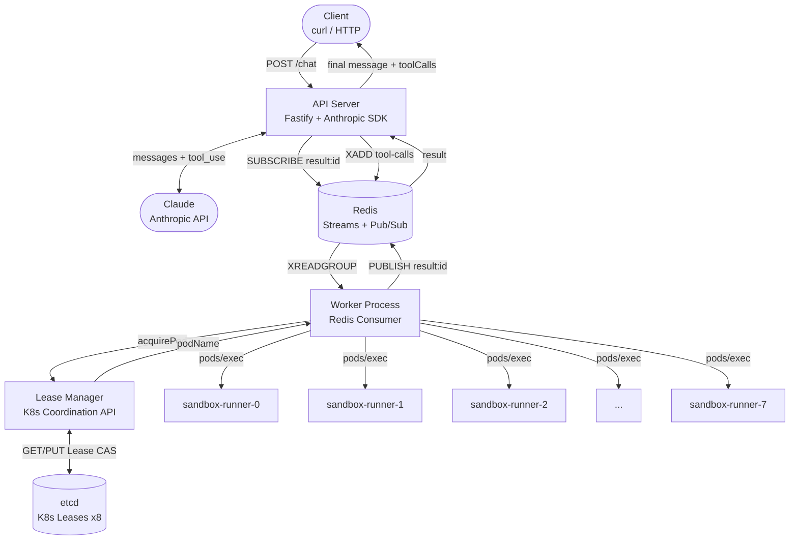

# distributed-llm-toolcalling

A TypeScript backend that runs an LLM agent where every tool call executes inside an isolated Kubernetes pod. The API uses Claude to process messages, and whenever Claude decides to call a tool, that call is routed through a Redis event stream to a worker process that acquires a Kubernetes Lease, executes the command inside a real pod via `pods/exec`, and streams the result back.

## Architecture



## How it works

### Request flow

1. `POST /chat` arrives with `sessionId` and `message`
2. API calls Claude with tool definitions (`shell_run`, `fs_read`, `env_inspect`)
3. Claude responds with a `tool_use` block
4. API subscribes to `result:{toolCallId}` on Redis **before** publishing the job
5. API publishes the job to the `tool-calls` Redis stream
6. Worker reads the job via `XREADGROUP`, tries to acquire a K8s Lease for one of the 8 pods
7. If all pods are busy, the job enters a FIFO queue (15s timeout)
8. Once a Lease is acquired, worker runs the tool via `kubectl exec` inside the pod
9. Worker publishes result to `result:{toolCallId}` and releases the Lease
10. API receives the result, sends it back to Claude as `tool_result`
11. Claude produces the final message, API responds to the client

### Lease model

Each of the 8 sandbox pods has a corresponding `coordination.k8s.io/v1` Lease object in etcd. Before touching a pod, the worker must acquire its Lease using optimistic concurrency:

```
GET lease → check holderIdentity + TTL
→ free or expired? → PUT with resourceVersion (atomic CAS)
→ 409 Conflict?    → try next pod
→ all busy?        → FIFO queue, 15s max wait
```

If the worker crashes mid-execution, the Lease expires after 45s and the next worker recovers it automatically.

### Tools

| Tool | Description | Runs in pod |
|------|-------------|-------------|
| `shell_run` | Runs an allowlisted shell command (`pwd`, `ls`, `cat`, `whoami`, `node --version`) | yes |
| `fs_read` | Reads a file from `/sandbox` — path traversal blocked | yes |
| `env_inspect` | Returns pod name, namespace, hostname, node version | yes |

### Queue behavior

With 8 pods and N concurrent tool calls:
- First 8 acquire pods immediately
- Remaining N-8 enter the FIFO queue
- Each waiter has a 15s deadline — if no pod frees up in time, returns `sandbox_capacity_timeout`

## Stack

- **Runtime**: Node.js 22, TypeScript
- **API**: Fastify
- **LLM**: Anthropic Claude (`claude-sonnet-4-6`)
- **Queue**: Redis Streams (`ioredis`) + Pub/Sub for result correlation
- **Orchestration**: Kubernetes (`@kubernetes/client-node`) — StatefulSet, Leases, `pods/exec`
- **Local K8s**: minikube
- **Tests**: Vitest

## Getting started

### Prerequisites

- Node.js 22+
- minikube (`minikube start`)
- `kubectl` configured
- Redis CLI (for debugging)

### 1. Install dependencies

```bash
npm install
```

### 2. Configure environment

```bash
cp .env.example .env
# fill in ANTHROPIC_API_KEY
```

### 3. Start minikube and apply manifests

```bash
minikube start

kubectl apply -f k8s/namespace.yaml
kubectl apply -f k8s/rbac.yaml
kubectl apply -f k8s/redis.yaml
kubectl apply -f k8s/statefulset.yaml
kubectl apply -f k8s/leases.yaml

# wait for pods
kubectl wait --for=condition=ready pod -l app=sandbox-runner -n sendai --timeout=120s
kubectl wait --for=condition=ready pod -l app=redis -n sendai --timeout=60s
```

### 4. Port-forward Redis

```bash
kubectl port-forward svc/redis 6379:6379 -n sendai &
```

### 5. Start the worker

```bash
npm run dev:worker
```

### 6. Start the API

```bash
npm run dev
```

### 7. Chat

```bash
curl -s -X POST localhost:3000/chat \
  -H "Content-Type: application/json" \
  -d '{"sessionId":"s1","message":"run whoami and ls in the sandbox"}' | jq .
```

### Check pod state

```bash
curl -s localhost:3000/pods | jq .
curl -s localhost:3000/health | jq .
```

## Running tests

```bash
# unit tests (no cluster needed)
npm test

# stress test (requires running cluster + worker)
npm run stress
```

### Stress test results (8 pods)

| Phase | Concurrent jobs | Completed | Failed | p50 | p95 |
|-------|----------------|-----------|--------|-----|-----|
| Baseline | 8 | 8 | 0 | 199ms | 355ms |
| Load | 16 | 16 | 0 | 416ms | 607ms |
| Mixed tools | 24 | 23 | 1 | 605ms | 1044ms |
| Overload | 50 | 43 | 7 | 1754ms | 30003ms |

Failures at high concurrency are expected — they hit the 15s queue timeout when all 8 pods are saturated.

## Endpoints

| Method | Path | Description |
|--------|------|-------------|
| `POST` | `/chat` | Run a chat session with tool execution |
| `GET` | `/pods` | Current lease state of all 8 sandbox pods |
| `GET` | `/health` | Service health + K8s connectivity |

### Example `/chat` response

```json
{
  "sessionId": "s1",
  "message": "You are running as root on sandbox-runner-4.",
  "toolCalls": [
    {
      "toolCallId": "toolu_01abc",
      "tool": "shell_run",
      "status": "completed",
      "executedIn": "pod",
      "pod": "sandbox-runner-4",
      "durationMs": 110
    }
  ]
}
```

### Example `/pods` response

```json
{
  "pods": [
    { "name": "sandbox-runner-0", "lease": { "status": "free" } },
    {
      "name": "sandbox-runner-1",
      "lease": {
        "status": "leased",
        "holderIdentity": "worker-host-abc:req-123:session-s1:tool-xyz",
        "expiresAt": "2026-06-10T12:00:45.000Z"
      }
    }
  ]
}
```

## Production considerations

### Process-local queue
The current `LeaseManager.waiters[]` is in-process. With multiple API replicas, a pod released on replica A only wakes up waiters on replica A — replica B's waiters starve. Replace with a Redis list (`BRPOP`) or BullMQ.

### Lease renewal
Long-running tools can outlive the 45s Lease TTL. Add a heartbeat loop that `PUT`s the Lease every 10s during execution. On `409 Conflict`, abort — another worker recovered the pod.

### Pod image hardening
Current image is `node:22-alpine`. Production should use a distroless or custom image with only the required binaries, no shell if possible, and a read-only root filesystem except `/sandbox`.

### Network isolation
Sandbox pods should have a `NetworkPolicy` that blocks all egress except to the worker (for exec). Currently pods have unrestricted egress.

### Multi-tenant limits
Add per-session or per-user concurrency limits at the Redis queue layer — a single user should not be able to hold all 8 pods.

### Metrics
Expose Prometheus metrics: queue depth, lease acquisition latency, tool execution duration, pod utilization per pod name, timeout rate.

## Project structure

```
src/
  anthropic/      Claude client + tool-calling loop
  executor/       local.ts (phase 1) + redis.ts (phase 2)
  queue/          Redis stream + pub/sub helpers
  sandbox/        lease-manager.ts + pod-executor.ts
  tools/          shell_run, fs_read, env_inspect definitions
  routes/         chat, pods, health
  worker/         Redis consumer process
k8s/              Kubernetes manifests
tests/
  unit/           tool logic tests (no cluster needed)
  stress/         concurrent load test against live cluster
```
